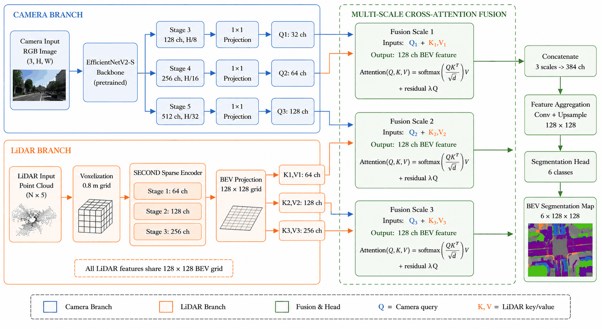
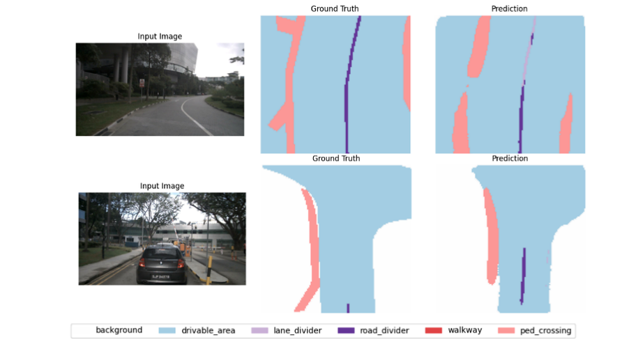
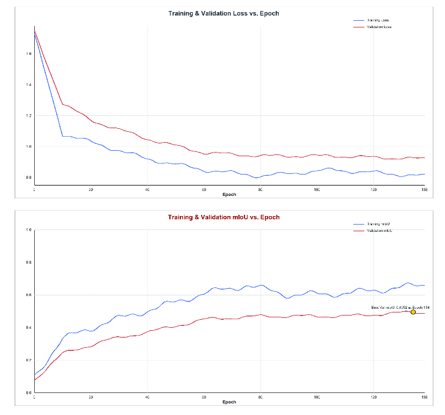
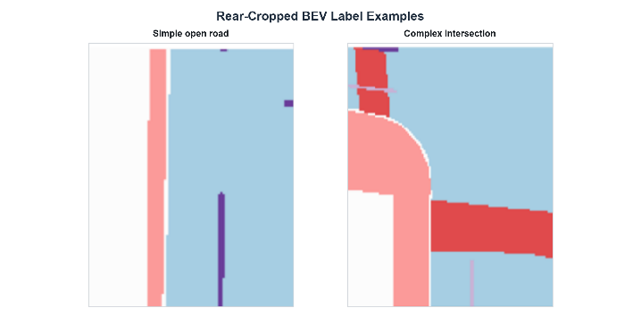
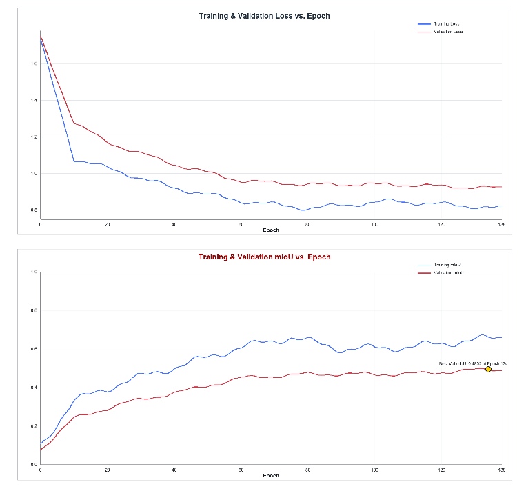
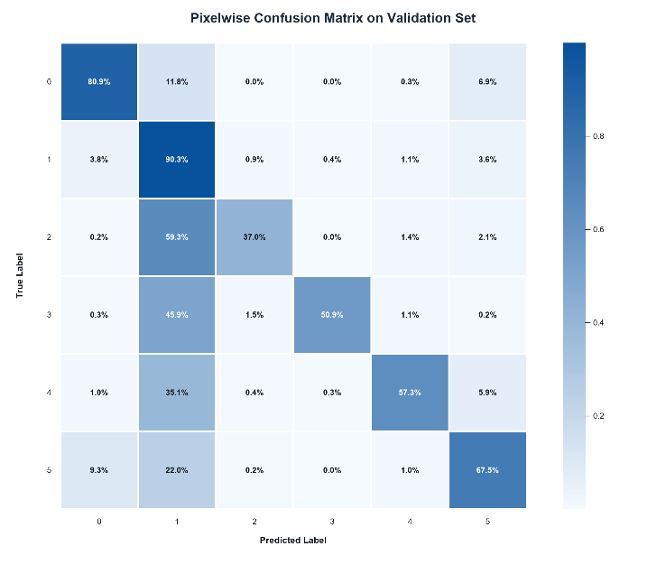
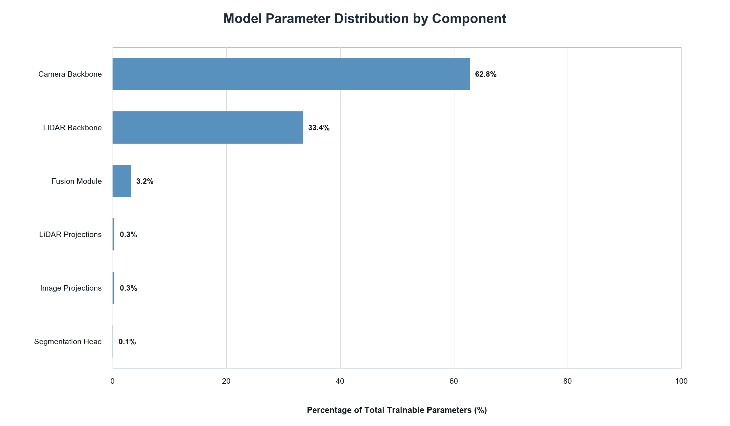

<div align="center">

# Bird's-Eye View Semantic Segmentation for Autonomous Driving via Limited Multi-Modal Sensor Fusion

**How far can BEV perception go with just one camera and one LiDAR?**

[](LICENSE)
[](https://www.python.org/)
[](https://pytorch.org/)
[](paper/paper.pdf)

</div>

This repository is the official implementation of *"Bird's-Eye View Semantic Segmentation for Autonomous Driving via Limited Multi-Modal Sensor Fusion"*, developed as part of a research internship at **Autonomous Lab, Research Centre for Smart Mechatronics, National Research and Innovation Agency of Indonesia (BRIN)**.

Most state-of-the-art BEV segmentation methods (LSS, BEVFormer, BEVFusion) assume six surround cameras and dense LiDAR — a sensor budget that compact, cost-constrained platforms simply don't have. This work asks a narrower question instead: **is a single front camera plus a single LiDAR enough to produce a usable BEV semantic map?** The target platform is MEVi, a Micro Electric Autonomous Vehicle built with exactly that sensor configuration.

<p align="center">
  
</p>

## Abstract

> This paper investigates whether a single front camera and a single LiDAR are sufficient for Bird's-Eye View (BEV) semantic segmentation on cost-constrained autonomous platforms. State-of-the-art BEV methods rely on six surround cameras and dense LiDAR, which is impractical for cost-constrained vehicles such as MEVi, a Micro Electric Autonomous Vehicle. We propose a multi-modal fusion network combining an EfficientNetV2-S camera backbone with a SECOND-based LiDAR backbone, integrated through a three-stage cross-attention mechanism. Trained on a subset of the nuScenes dataset and evaluated on the complete official nuScenes validation split, the model achieves 49.4% mean Intersection over Union (mIoU), exceeding the six-camera LSS baseline (44.4%) and approaching the six-camera-plus-LiDAR BEVFusion method (56.6%). Drivable area is detected reliably (83.7% IoU); thin structures such as lane and road dividers remain challenging (23.6% and 34.3% IoU). These results demonstrate that minimal-modality BEV perception is viable for navigable space detection on resource-constrained autonomous vehicles, with a model whose fusion pipeline accounts for less than 4% of total trainable parameters.

## Highlights

- **1 camera + 1 LiDAR** — the first evaluation of this sensor configuration for BEV semantic segmentation on nuScenes.
- **49.4% mIoU** on the full official nuScenes validation split, ahead of the six-camera LSS baseline (44.4%) and within reach of six-camera + LiDAR BEVFusion (56.6%).
- **83.7% IoU on drivable area**, the class that matters most for motion planning.
- **Lightweight fusion** — the three-stage cross-attention module, projections, and segmentation head together add less than 4% to the total parameter count; the footprint is set almost entirely by the backbone choice.

## Method

Two backbones feed a three-stage cross-attention fusion module:

- **Camera branch** — EfficientNetV2-S (ImageNet-pretrained), tapped at three stages (channels projected to 32 / 64 / 128) to produce multi-scale queries.
- **LiDAR branch** — a SECOND-style sparse-convolution encoder over 0.8 m voxels, projected to a shared 128×128 BEV grid at three feature scales (64 / 128 / 256 channels), used as keys/values.
- **Fusion** — at each of the three scales, image features query LiDAR features via scaled dot-product attention with a learnable residual weight; the three fused scales are concatenated and aggregated into a single 128-channel, 128×128 BEV feature map.
- **Head** — a lightweight grouped-convolution segmentation head predicts 6 BEV classes (background, drivable area, lane divider, road divider, walkway, pedestrian crossing), trained with a combination of focal loss and dice loss plus static class weighting to handle severe class imbalance.

Full architectural and training details are in the [paper](paper/paper.pdf).

## Results

**Table I. Class-wise and mean IoU (%) on the official nuScenes validation split.**

| Method | Modality | Training data | Background | Drivable Area | Lane Divider | Road Divider | Walkway | Ped. Crossing | **mIoU** |
|---|---|---|---|---|---|---|---|---|---|
| LSS | 6C | Full | – | 75.4 | 20.0 | – | 46.3 | 38.8 | **44.4** |
| BEVFusion | 6C+1L | Full | – | 85.5 | 46.4 | – | 67.6 | 60.5 | **56.6** |
| Proposed (train split, for reference) | 1C+1L | 50% subset* | 75.3 | 88.2 | 35.9 | 44.2 | 72.2 | 70.1 | **64.3** |
| **Proposed (val)** | **1C+1L** | **50% subset\*** | 62.9 | 83.7 | 23.6 | 34.3 | 40.9 | 51.4 | **49.4** |

<sub>*Trained on ~50% of the nuScenes train split (~14k samples, 350 scenes). All rows are evaluated on the same full official nuScenes val split (6,019 samples, 150 scenes). LSS and BEVFusion numbers are as reported in their respective papers, included here for context — not a claim of outperformance, since they use six cameras and the full training split.</sub>

<p align="center">
  
</p>

<p align="center">
  
  <br><sub>Predictions on the validation split. Drivable area is detected consistently; thin lane/road dividers are the main failure mode.</sub>
</p>

<details>
<summary>More figures (BEV labels, training-set predictions, confusion matrix, parameter distribution)</summary>

<p align="center">
  
</p>
<p align="center">
  
</p>
<p align="center">
  
</p>
<p align="center">
  
</p>

</details>

**Known limitations** (see the paper's Discussion for details): a ~16-point train/val mIoU gap driven by the reduced (50%) training subset and the high capacity of EfficientNetV2-S relative to available data; and weak IoU on thin, high-aspect-ratio classes (lane/road dividers), which are 1–2 pixels wide at 0.8 m/pixel resolution.

## Repository structure

```
├── configs/                  # model.yaml (architecture) and train.yaml (optimization/data)
├── datasets/
│   ├── nuscenes_data.py          # raw nuScenes filtering + on-the-fly BEV label rasterization
│   ├── precomputed_bev_dataset.py # fast dataset that loads precomputed BEV labels
│   ├── augmentation.py           # BEV-space augmentation (flip, rotate, scale, cutout, mixup, ...)
│   └── validate_dataset.py
├── models/
│   ├── backbones.py          # EfficientNetV2-S camera backbone, SECOND LiDAR backbone
│   ├── fusion.py              # multi-scale cross-attention fusion module
│   ├── heads.py               # segmentation head + focal/dice loss
│   └── bev_model.py            # end-to-end model wrapper (used by test.py & inference.py)
├── scripts/
│   ├── precompute_bev_labels.py  # rasterize nuScenes HD maps into BEV label grids (run this first)
│   ├── train.sh / test.sh        # convenience launch scripts
│   └── analyze_nuscenes_splits.py, check_*.py  # dataset sanity-check utilities
├── utils/                    # metrics (IoU/precision/recall), early stopping, logging, config loading
├── train.py                  # training entry point
├── test.py                   # evaluation entry point (dataset-wide metrics)
├── inference.py               # single-sample inference / demo
├── assets/figures/            # figures used in this README, exported from the paper
└── paper/paper.pdf            # the paper itself
```

## Installation

```bash
git clone https://github.com/dityrwp/autonomous.git
cd autonomous

conda create -n bev python=3.8 -y
conda activate bev
pip install -r requirements.txt
```

`spconv-cu118` in `requirements.txt` must match your installed CUDA toolkit — swap it for the `spconv-cu***` build matching your CUDA version if you're not on CUDA 11.8 (see the [spconv releases](https://github.com/traveller59/spconv)).

This project uses the [nuScenes dataset](https://www.nuscenes.org/) (`v1.0-trainval`), including its HD map expansion, which must be downloaded separately under its own license.

## Usage

**1. Precompute BEV labels** (rasterizes nuScenes HD maps into label grids once, so training doesn't redo it every epoch):

```bash
python scripts/precompute_bev_labels.py \
    --dataroot /path/to/nuscenes \
    --version v1.0-trainval \
    --splits train val \
    --output-dir /path/to/bev_labels
```

**2. Train:**

```bash
bash scripts/train.sh \
    --dataroot /path/to/nuscenes \
    --bev-labels-dir /path/to/bev_labels \
    --output-dir outputs
```

or call `train.py` directly for finer control (learning-rate groups, augmentation strength, early stopping, etc. — see `python train.py --help`):

```bash
python train.py \
    --model-config configs/model.yaml \
    --train-config configs/train.yaml \
    --dataroot /path/to/nuscenes \
    --bev-labels-dir /path/to/bev_labels \
    --output-dir outputs \
    --early-stopping --patience 5
```

**3. Evaluate:**

```bash
bash scripts/test.sh \
    --checkpoint outputs/checkpoints/best_model.pth \
    --dataroot /path/to/nuscenes \
    --bev-labels-dir /path/to/bev_labels \
    --split val
```

**4. Run inference on a single sample** (quick demo / checkpoint smoke test — no full dataset needed, just one image + one LiDAR `.bin`):

```bash
python inference.py \
    --model-config configs/model.yaml \
    --checkpoint outputs/checkpoints/best_model.pth \
    --image sample.jpg \
    --lidar sample.bin \
    --output prediction.png \
    --side-by-side
```

All hyperparameters (learning rates per component, loss weights, augmentation, scheduler) live in [`configs/model.yaml`](configs/model.yaml) and [`configs/train.yaml`](configs/train.yaml).

## Citation

If you use this code or build on this work, please cite:

```bibtex
@misc{baskoro2026bevfusion,
  title  = {Bird's-Eye View Semantic Segmentation for Autonomous Driving via Limited Multi-Modal Sensor Fusion},
  author = {Baskoro, Muhammad Aditya R. and Wahono, Bambang and Furqon, Maulana and
            Salim, Taufik Ibnu and Praptijanto, Achmad and Tjolleng, Amir and
            Ali, Husni Rois and Pramana, Rakhmad Indra},
  year   = {2026},
  note   = {Manuscript submitted for publication},
  url    = {https://github.com/dityrwp/autonomous}
}
```

*(Citation will be updated with the official venue/DOI once the paper is published — see [CITATION.cff](CITATION.cff) for the machine-readable version.)*

## Acknowledgements

This work was carried out as part of a research internship at the **Autonomous Lab, Research Centre for Smart Mechatronics, National Research and Innovation Agency of the Republic of Indonesia (BRIN)**, in collaboration with **Universitas Gadjah Mada** and **Bina Nusantara University**. Built on top of [nuScenes](https://www.nuscenes.org/), [EfficientNetV2](https://arxiv.org/abs/2104.00298), [SECOND](https://www.mdpi.com/1424-8220/18/10/3337), and [spconv](https://github.com/traveller59/spconv).

## License

Released under the [MIT License](LICENSE).
